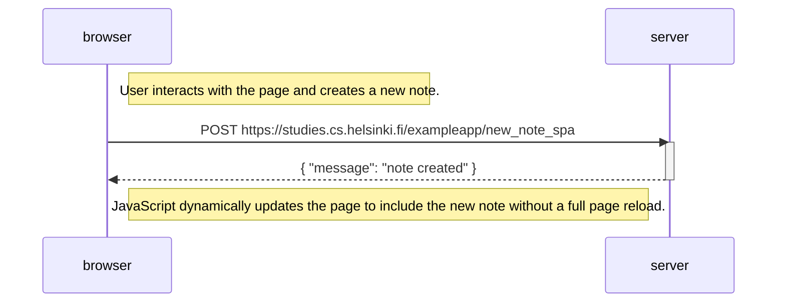

```mermaid
sequenceDiagram
    participant browser
    participant server

    Note right of browser: User interacts with the page and creates a new note.

    browser->>server: POST https://studies.cs.helsinki.fi/exampleapp/new_note_spa
    activate server
    server-->>browser: { "message": "note created" }
    deactivate server

    Note right of browser: JavaScript dynamically updates the page to include the new note without a full page reload.
```